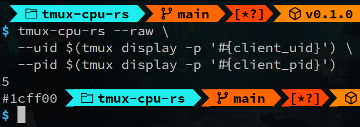

# tmux-cpu-rs

A small, fast Rust-based CLI tool to display CPU usage inside your `tmux` status line — with [**caching**](#how-it-works-and-stuff) for efficiency, and optional gradients & formatting.


## Platform Support

**Linux only** - This tool reads CPU statistics from `/proc/stat` and only works on Linux systems.

**Tested and supported architectures:**
- x86_64 (64-bit Intel/AMD)

**Untested architectures:**
- aarch64 (64-bit ARM)
- armv7 (32-bit ARM)
- i686 (32-bit Intel/AMD)

**Note:** `tmux-cpu-rs` should still work on untested architectures, since there's no architecture specific code.

---

## Features

- ✅ **Accurate CPU usage** using `/proc/stat`
- 🎨 **Color gradients** from green (low) to red (high) CPU usage
- 🖋 **Customizable formatting** with `tmux`-like format strings
- ⚡ **Caching** for minimal system overhead
- 🛠 **Raw output mode** for re-use in scripts
- 🔧 **Configurable precision** for `f64`-based stats

---

## Installation

Using `cargo`:

```console
cargo install tmux-cpu-rs
```

Or clone and build manually:

```console
git clone https://github.com/playbahn/tmux-cpu-rs
cd tmux-cpu-rs
cargo build --release
```

Or you can grab pre-built binary(s) from the [Releases](https://github.com/playbahn/tmux-cpu-rs/releases) page.

---

## Usage

```console
Usage: tmux-cpu-rs [OPTIONS] <PID>

Arguments:
  <PID>  Pass in #{client_pid}

Options:
  -H, --no-hook                Disable setting of cache removal hooks (client-detached, session-closed)
  -P, --precision <PRECISION>  f64 precision to use for displayed stats [default: 0]
  -b, --before <BEFORE>        Tmux format strings (sort of) to place before CPU usage (see below)
  -a, --after <AFTER>          Tmux format strings (sort of) to place after CPU usage (see below)
  -r, --raw                    Get CPU usage and gradient in a "raw" reusable format (see below)
  -c, --cachedir <CACHEDIR>    Directory to cache stats in [default: /tmp/tmcpu/]
  -d, --display <DELAY>        Display output in status line with `tmux display-message` [aliases: --delay]
  -h, --help                   Print help
  -V, --version                Print version

...
```

## Formatting

`--before` and `--after` take `tmux`-like format strings in the form: `--before '#<style>text'`

where:

1. **text** is any valid UTF-8 text (printed as-is)

2. **style** uses `tmux` style syntax (validity is not checked), but with an additional feature:

    Every occurrence of the word **HEXGRAD** inside the style string will be replaced by a color value ranging from Hue 120° (green) to Hue 0° (red) depending on CPU usage.

## Example

```tmux
set -g status-right "#(path/to/tmux-cpu-rs #{client_pid} -P1 -b '#<fg=HEXGRAD>') "
```

With a low CPU usage, the above will render as:


## Raw Output

When using `--raw`, the output format becomes:

```console
USAGE\nHEXGRAD
```

where:

- `USAGE` is the numeric CPU usage
- `\n` is the Unicode U+000A newline character
- `HEXGRAD` is the computed color (hex string)

This is useful if you want to build your own custom `tmux` formatting or use the values in other scripts.

---

## Example tmux Integrations

Adding a percent sign after usage:

```tmux
set -g status-right "#(path/to/tmux-cpu-rs #{client_pid} --precision 1 --after %) "
```


With gradients turned on:

```tmux
set -g status-right "#(path/to/tmux-cpu-rs #{client_pid} -P1 --before '#<fg=HEXGRAD>' -a%) "
```


`tmux-cpu-rs` emits plain `tmux` format strings. So, styles are persistent:

```tmux
set -g status-right "#(path/to/tmux-cpu-rs #{client_pid} -b '#<fg=HEXGRAD>' -a%)"
set -ga status-right " #[reverse] #H #[noreverse]"
```


This will have to be resolved by resetting the style with either the last `--after` option:

```tmux
set -g status-right "#(path/to/tmux-cpu-rs #{client_pid} \
-b '#<fg=HEXGRAD>' -a% -a '#<fg=default>' \
) #[reverse] #H #[noreverse]"
```

or with an embedded style string before the next text:

```tmux
set -g status-right "#(path/to/tmux-cpu-rs #{client_pid} \
-b '#<fg=HEXGRAD>' -a% \
) #[fg=default,reverse] #H #[noreverse]"
```


`--raw`:

```console
path/to/tmux-cpu-rs $(tmux display -p '#{client_pid}') --raw
```



With Nerd Font (Powerline) half circles:

```tmux
set -g status-right "#(path/to/tmux-cpu-rs #{client_pid} \
-P1 \
-b '#<fg=HEXGRAD>\uE0B6' \
-b '#<reverse,bold>\uF4BC ' \
-a '#<noreverse>\uE0B4' \
) #[fg=default]\uE0B6#[reverse,bold]#H#[noreverse]\uE0B4"
```


With Nerd Font (Powerline) right dividers:

```tmux
set -g status-right "#(path/to/tmux-cpu-rs #{client_pid} \
-P2 \
-b '#<fg=HEXGRAD>\uE0B2' \
-b '#<reverse,bold> \uF4BC ' \
-a ' ' \
-a '#<noreverse,bg=#14b5ff>\uE0D6'\
)#[fg=default,bg=default,reverse,bold] #H "
```


### Note

Unicode escape sequences in the form given above are only rendered as glyphs if they're parsed by `tmux`. In other words, this works at the `tmux` command prompt or `.tmux.conf`:

```tmux
display "A\uE0B2B"
```

But at the (`bash`) shell command prompt or a (`bash`) shell script, it will need to be written as:

```bash
tmux display "A"$'\uE0B2'"B"
```

---

## How it works and stuff

Firstly, `tmux-cpu-rs` runs *only* when it's invoked with `#()`. It is as "frequent" as the `status-interval` your client is using. Users with lower `status-interval`s (say 1 second) will see more sensible stats than user with a higher `status-interval` (say 5 second).

The first time it is invoked it finds no past or "old" stats, so it only caches the current stats in a temp file with the name `XYZ` for a passed client_pid of `XYZ`) in the cachedir[^1], and sets two hooks[^2] at `client-detached` and `session-closed` (see [`tmux(1)`](https://man.openbsd.org/OpenBSD-current/man1/tmux.1)) for the removal of that cache file.

For every subsequent run it updates the cache, and prints new usage stats to stdout.

Additionally, you could also redirect the stderr of `tmux-cpu-rs` inside the same `#()` with `2> /tmp/tmcpu.log` if something's not working.

[^1]: cachedir is `/tmp/tmcpu/` by default.

[^2]: To be exact, the hooks are appended, with `-a`. Not setting hooks can be achieved with `--no-hook`.

## ANOTHER CPU usage monitor?

While looking for a CPU usage monitor for my `tmux` statusline, I looked through some options, but was kind of annoyed by the fact that all (couldn't have been more than one or two) of them `sleep` every time `tmux` evaluates `#()`'s. Taking a *noticeable* time to end execution, throwing away current values, I wasn't happy. So, I wrote one in Rust that cached current stats in `/tmp` for the next delta calculation for CPU usage. I looked once more, and found [tmux-plugins/tmux-cpu](https://github.com/tmux-plugins/tmux-cpu). Although `tmux-cpu-rs` is not a rewrite of the CPU portion of `tmux-plugins/tmux-cpu` (they also have a GPU portion), they're quite similar, as they both use caching. Then, I thought "let's make it use-able by people" and here we are. I would say the (deemed) *selling point* of `tmux-cpu-rs` would be caching.

---

## License

This project is licensed under either of

* Apache License, Version 2.0, ([LICENSE-APACHE](./LICENSE-APACHE) or http://www.apache.org/licenses/LICENSE-2.0)
* MIT license ([LICENSE-MIT](./LICENSE-MIT) or http://opensource.org/licenses/MIT)

at your option.
